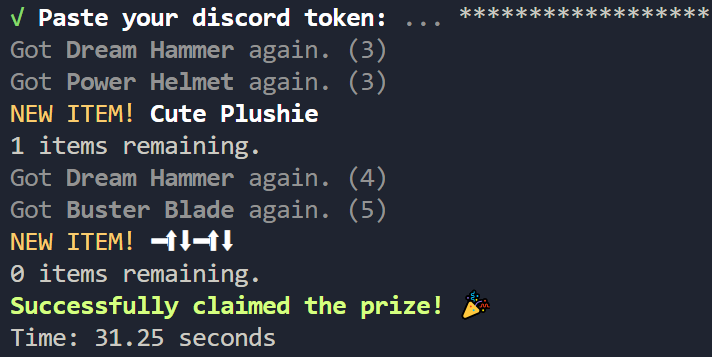
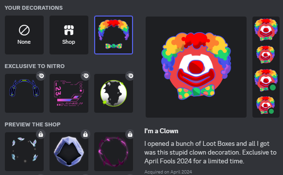

# 🎁 Automated Discord Loot Boxes 🎁

Automatically opens discord loot boxes and claims the decoration reward, even __without access__ to loot boxes!




Even though for some people loot boxes may appear like they have been removed from Discord app, the API is still up and running, which means you can still get the profile decoration if you haven't already!

## Setup

1. Download this git repo.
2. Install [NodeJS](https://nodejs.org/) on your computer.
3. Open CMD in the directory where you have the repository installed.
4. Execute these commands:
    ```sh
    npm install
    npm start
    ```
5. Paste your discord token.

Done! 🎉

## Is it safe?

Probably yes, this program doesn't store your token anywhere. You have a higher chance of Discord banning you (for some reason), but the most likely won't care.

> 👉 Remember to never share your discord token!

<details>
    <summary><h3>Disclaimer ⚠</h3></summary>
    This code is provided for educational purposes only. Please do not use it in production environments without proper understanding and testing. Copy-pasting code without comprehension may lead to unintended consequences. Always ensure to review and understand the code before using it in any context. Use at your own risk.
</details>